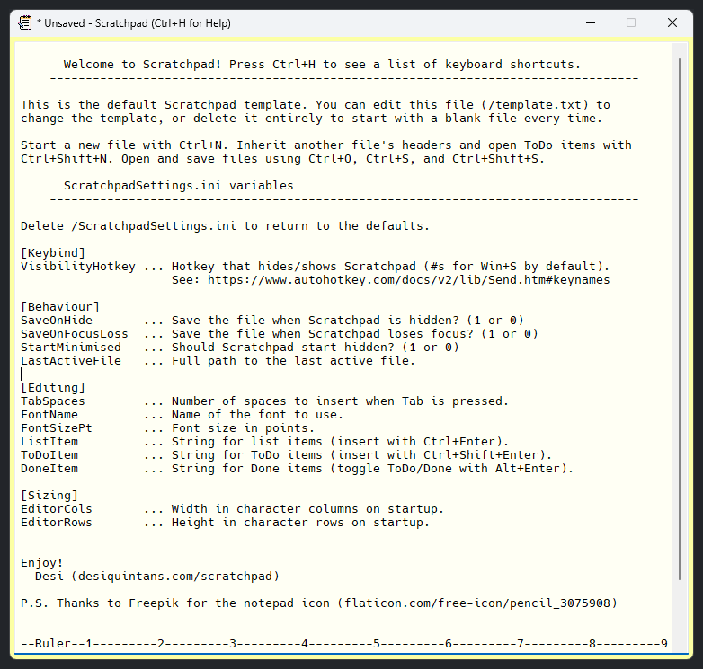

# Scratchpad: The rapid note-taking tool

<http://www.desiquintans.com/scratchpad>

<https://github.com/DesiQuintans/scratchpad>

## What is this?

Scratchpad is a plain text note-taking tool that can be shown when you need it and hidden instantly when you don't. It excels at keeping the kinds of notes that you make throughout a working day. For example:

1. Programmers and writers can use it to store snippets of text.
	- Scratchpad is always-on-top and resizeable, so it's convenient to copy from a document and paste into Scratchpad.
2. Workers can use it to keep a to-do list.
	- Scratchpad has org-like controls for adding list items and to-do items, for moving them around and indenting them, and for toggling their to-do/done states.
3. Workers can carry over to-do lists across time.
	- Scratchpad lets you roll-over unfinished to-do items from one file into a new one, without changing the original file. I use this for keeping a weekly to-do list so that I have a full history of my notes and tasks over time.

Scratchpad auto-saves whenever it is hidden or dropped to the background, and auto-refreshes if the file is edited by other programs. This makes it safe to use in cloud services like Dropbox or OneDrive.

## Installation

There is no installation process; Scratchpad is self-contained. Extract `Scratchpad.exe` and `template.txt` from the _.zip_ file, put them wherever you want, and run `Scratchpad.exe`. `ScratchpadSettings.ini` will be created alongside it.

## Usage/workflow

1. When I first start using Scratchpad, I use `Ctrl + N` to create a new file (edit `/template.txt` to change what this template looks like).
2. I save this file with a name like "2023-07-24.txt".
3. As new tasks come in, I add them to my list with `Alt + Shift + Enter`.
4. When I finish a task, I mark it finished with `Ctrl + Enter`.
5. At the start of a new week, I press `Ctrl + Shift + N` and choose last week's file. This copies last week's unfinished tasks to this week's new list.
6. Repeat from #2 forever.

## Features and commands

- Scratchpad
	- `Win + S` (default)		Show/hide Scratchpad (user-editable)
	- `Escape`					Hide Scratchpad
	- `Ctrl + H`				Help window
- File operations
	- `Ctrl + N`				New file from template (`/template.txt`)
	- `Ctrl + Shift + N`		New file from past file's to-do items
	- `Ctrl + S`				Save manually
	- `Ctrl + Shift + S`		Save As manually
	- `Ctrl + O`				Open a file
- Insert list items
	- `Alt + Enter`				New bullet list item
	- `Alt + Shift + Enter`		New to-do list item
	- `Ctrl + Enter`			Toggle to-do/done
- Move lines
	- `Alt + Right/Left`		Indent or outdent
	- `Alt + Up/Down`			Move line up or down

## User-editable options (`ScratchpadSettings.ini`)

- [Keybind]
	- `VisibilityHotkey`		Hotkey to show/hide Scratchpad (SP), in a form recognised by the [`Send` command](https://www.autohotkey.com/docs/v2/lib/Send.htm).
- [Behaviour]
	- `SaveOnHide`				If `1`, autosaves when SP is hidden.
	- `SaveOnFocusLoss`			If `1`, autosaves when SP goes to the background.
	- `StartMinimised`			If `1`, SP starts hidden.
- [Editing]
	- `TabSpaces`				Number of spaces in an indent. Used by `Tab` and by `Alt + Right/Left`.
	- `FontName`				Name of the font you want to use (ideally monospaced).
	- `FontSizePt`				Desired font size in points.
	- `ListItem`				Bullet to use for a list item. Defaults to GFM's `- `.
	- `ToDoItem`				Bullet to use for open to-do items. Defaults to GFM's `- [ ] `.
	- `DoneItem`				Bullet to use for done items. Defaults to GFM's `- [x] `.
- [Sizing]
	- `EditorCols`				Width of the editor, in characters.
	- `EditorRows`				Height of the editor, in lines of text.

## Why plain text?

A lot has been written by geeks and nerds about why plain text is great. Briefly: It's cross-platform; non-proprietary; stable over time; plays nicely with cloud storage services; and you can use regular expressions to flexibly search thousands of them at once and replace text inside them if needed.

# Known issues

- Undo/Redo is limited to one step (a Windows limitation for basic text inputs).
